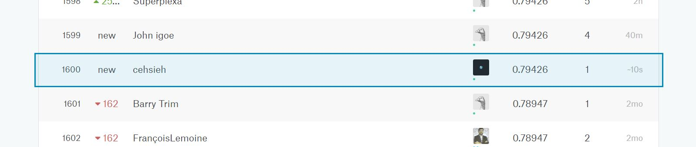

```{r setup, include=FALSE}
knitr::opts_chunk$set(echo = TRUE)
```

```{R echo = FALSE , message = FALSE}
library(ggplot2)
library(dplyr)
library(scales)
library(mice)
library(rpart)
library(randomForest)
library(plotly)
```

## 作業摘要

使用[Kaggle](https://www.kaggle.com)的[Titanic](https://www.kaggle.com/c/titanic)訓練及測試資料進行資料整理、分析、遺漏值填補以及建立預測模型，最後進行資料預測並提交結果，得到的分數為0.79426。

## 1.匯入資料

讀取kaggle_titanic_train.csv與kaggle_titanic_test.csv。觀察資料結構，發現Age、Fare與Embarked含有遺漏值。
``` {R echo = TRUE , message = FALSE , warning = FALSE}
train <- read.csv('kaggle_titanic_train.csv')
test  <- read.csv('kaggle_titanic_test.csv')
```

``` {R echo = TRUE , message = FALSE , warning = FALSE}
summary(train)
summary(test)
```

將兩個資料合併成一個名為titanic的dataframe，以利後續分析運用。
```{R echo = TRUE , message = FALSE , warning = FALSE}
titanic  <- bind_rows(train, test)
```

## 2.填補遺漏值

### 2.1 Missing values in "Embarked"

觀察登船港口遺漏資料，發現Fare都是80元，Passenger Class是1。
```{R echo = TRUE , message = FALSE , warning = FALSE}
embark_missing <- titanic %>%
  filter(Embarked == "")
head(embark_missing)
```

過濾掉Embarked遺漏值，以登船港口和乘客等級分別繪製票價盒鬚圖
```{R echo = TRUE , message = FALSE , warning = FALSE}
embark_fare <- titanic %>%
  filter(Embarked != "")
ggplot(embark_fare, aes(x = Embarked, y = Fare, fill = factor(Pclass))) +
  geom_boxplot() +
  ggtitle("登船港口和乘客等級之票價盒鬚圖")
```

發現票價80元與C港口高階乘客票價中位數差不多，故將Embarked兩個遺漏值填補為C。
```{R echo = TRUE , message = FALSE , warning = FALSE}
titanic$Embarked[titanic$Embarked == ""] <- "C"
```

### 2.2 Missing values in "Fare"

挑出遺漏Fare的該筆資料來觀看。
```{R echo = TRUE , message = FALSE , warning = FALSE}
fare_missing <- subset(titanic,is.na(titanic$Fare))
```
```{R echo = FALSE , message = FALSE , warning = FALSE}
head(fare_missing)
```

Pclass == '3'，Embarked == 's'，觀察符合這些條件的票價情況。
```{R echo = TRUE , message = FALSE , warning = FALSE}
third_s <- titanic[titanic$Pclass == '3' & titanic$Embarked == 'S', ]
```
```{R echo = FALSE , message = FALSE , warning = FALSE}
fare_density <- ggplot(third_s , aes(x = Fare)) + 
  geom_density(fill = '#2fb8be',alpha=0.5) + 
  ggtitle("南安普敦港口上船的第三階級乘客票價(Interactive chart)")
ggplotly(fare_density)
```
```{R echo = FALSE , message = FALSE , warning = FALSE}
summary(third_s$Fare)
```

這些條件下Fare最多落在8左右，與其中位數差不多，故以此填補Fare遺漏值。
```{R echo = TRUE , message = FALSE , warning = FALSE}
titanic$Fare[is.na(titanic$Fare)] <- median(third_s$Fare, na.rm = TRUE)
```

### 2.3 Missing values in "Age"

首先排除不太相關的變數，保留有用的變數，也能避免程式跑太久。
```{R echo = TRUE , message = FALSE , warning = FALSE}
mice_data <- titanic[, !names(titanic) %in% c('PassengerId','Name','Ticket','Cabin','Survived')]
```

使用mice套件處理Age的遺漏值，method使用Random Forest。
再將填補完成的結果輸出，並將原本的Age欄位替換成填補好的資料。
```{R echo = TRUE , message = FALSE , warning = FALSE , results = "hide"}
mice_result <- mice(mice_data, method='rf',seed = 9487)
mice_output <- complete(mice_result)
titanic$Age <- mice_output$Age
```

## 3.資料視覺化

運用填補好各個遺漏值的資料來進行視覺化圖表繪製與觀察。首先要將填補好遺漏值的titanic資料還原成train與test資料。以具備Survived值的train data進行圖表繪製。　　　
```{R echo = TRUE , message = FALSE , warning = FALSE}
train <- titanic[1:891,]
```
```{R echo = FALSE , message = FALSE , warning = FALSE}
ggplot(data = train, aes(x = Age, y = Survived, color = Sex)) +
  geom_point(alpha = 0.2) +
  geom_smooth(se = FALSE) +
  facet_grid(Pclass ~ .) +
  scale_color_manual(values = c("#ff7f50", "#2fb8be")) +
  ggtitle("各階級與各年齡層男女性的生存情形散佈圖")
```

以下幾點觀察發現：

- 整體而言三種階級以及各年齡層中，女性的生存率比男性高。
- 各階級中，中上層階級的女性更具有生存優勢。
- 各年齡層中，孩童的生存率較高，除了上層階級的女童部分。

## 4.建立模型及預測

分別使用Random Forest及Classification And Regression Tree來建立預測模型。
```{R echo = FALSE , message = FALSE , warning = FALSE}
titanic$Survived <- factor(titanic$Survived)
titanic$Embarked <- factor(titanic$Embarked)
```
```{R echo = TRUE , message = FALSE , warning = FALSE}
train <- titanic[1:891,]
test <- titanic[892:1309,]
set.seed(9487)
rf_fit <- randomForest(Survived ~ Pclass + Sex + Age + SibSp + Parch + Fare + Embarked , data = train, ntree = 200)
cart_fit <- rpart(Survived ~ Pclass + Sex + Age + SibSp + Parch + Fare + Embarked, data = train, method = "class")
```

進行測試資料預測。
```{R echo = TRUE , message = FALSE , warning = FALSE}
rf_prediction <- predict(rf_fit, newdata = test[, c("Pclass", "Sex", "Age", "SibSp", "Parch", "Fare", "Embarked")])
cart_prediction <- predict(cart_fit, newdata = test[, c("Pclass", "Sex", "Age", "SibSp", "Parch", "Fare", "Embarked")],type = "class")
```

輸出符合上傳格式的csv。
```{R echo = TRUE , message = FALSE , warning = FALSE}
to_submit_rf <- data.frame(test[, "PassengerId"], rf_prediction)
names(to_submit_rf) <- c("PassengerId", "Survived")
write.csv(to_submit_rf,file="to_be_submitted_rf.csv",row.names = FALSE)
```
```{R echo = TRUE , message = FALSE , warning = FALSE}
to_submit_cart <- data.frame(test[, "PassengerId"], cart_prediction)
names(to_submit_cart) <- c("PassengerId", "Survived")
write.csv(to_submit_cart,file="to_be_submitted_cart.csv",row.names = FALSE)
```

## 5.提交至Kaggle

使用隨機森林預測模型的結果分數為0.76555。
　　　　

使用決策樹預測模型的結果分數為**0.79426**。
